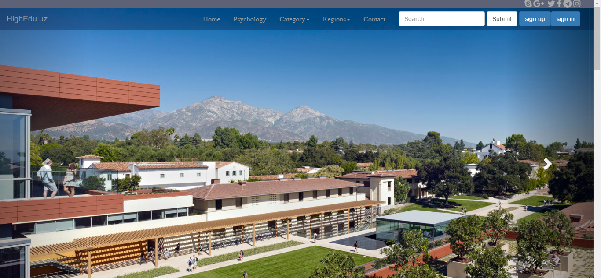

# Internet_Programming
A highly interactive website to get information about colleges and universities in Uzbekistan 
## Functionality 

The main index page welcomes its audience with an interactive news carousel showing news if added. On the main page, users can also see a navigation bar with all the required information for them to use all the features the website offers.

Programming used:
* Bootstrap for navigation and carousel
* JavaScript for animations  
