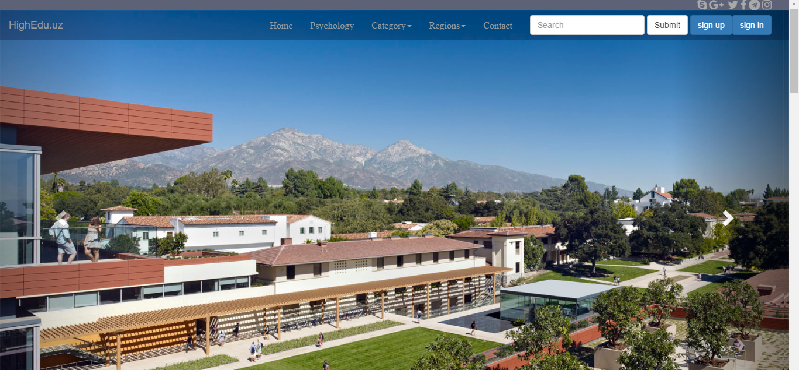
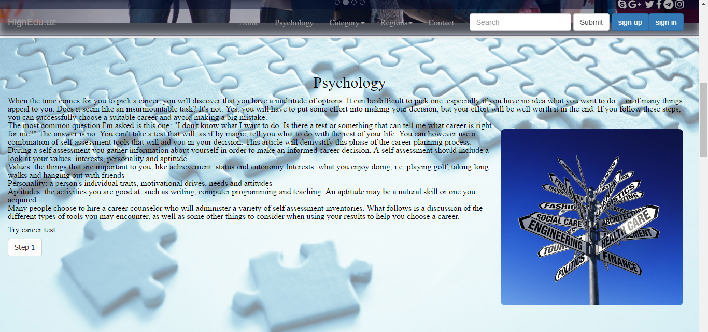
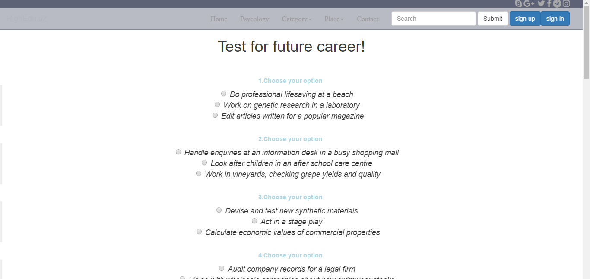
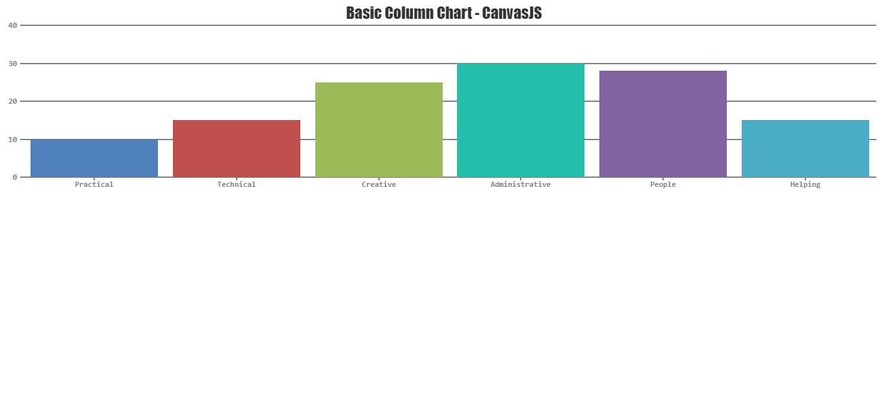
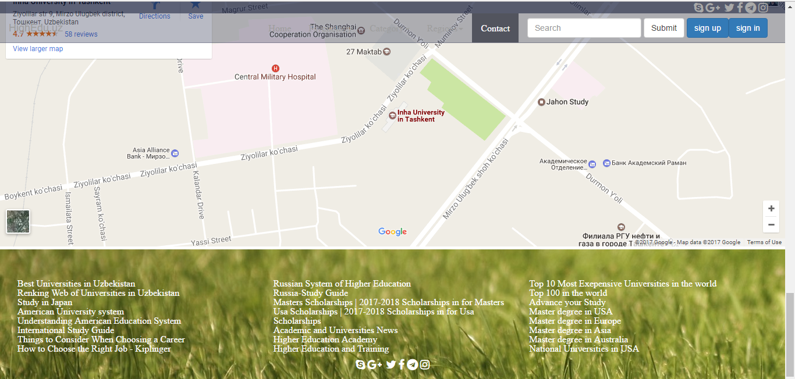
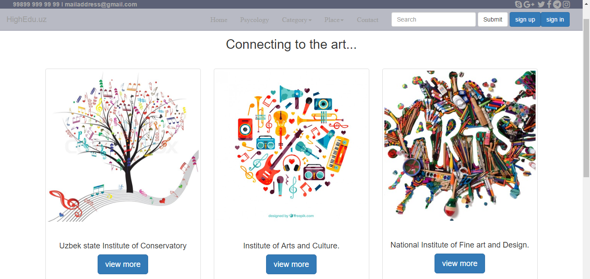
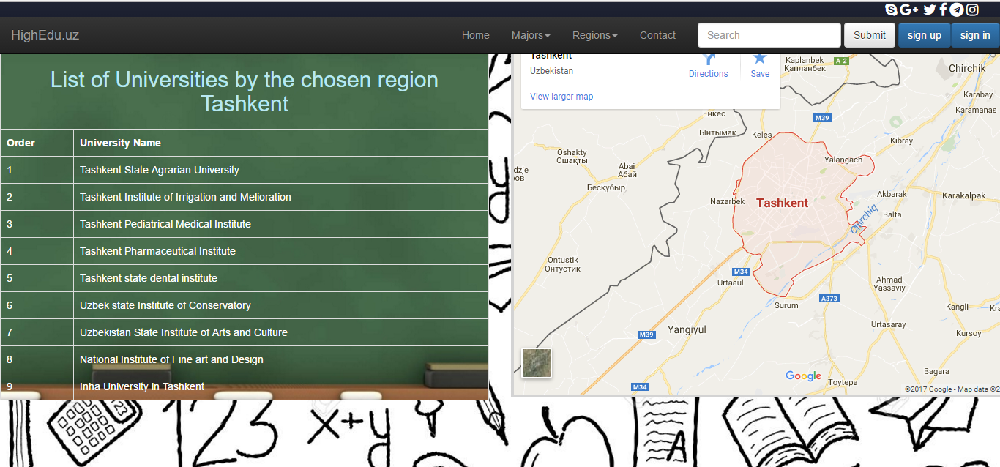
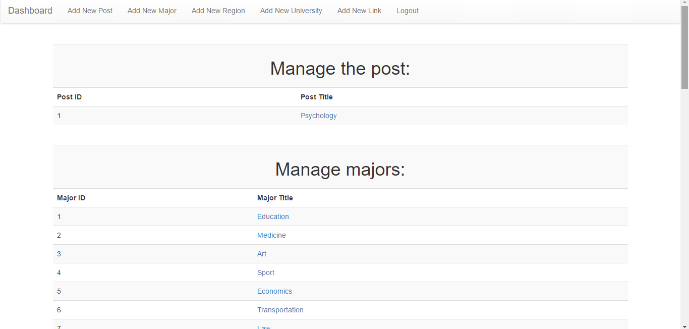
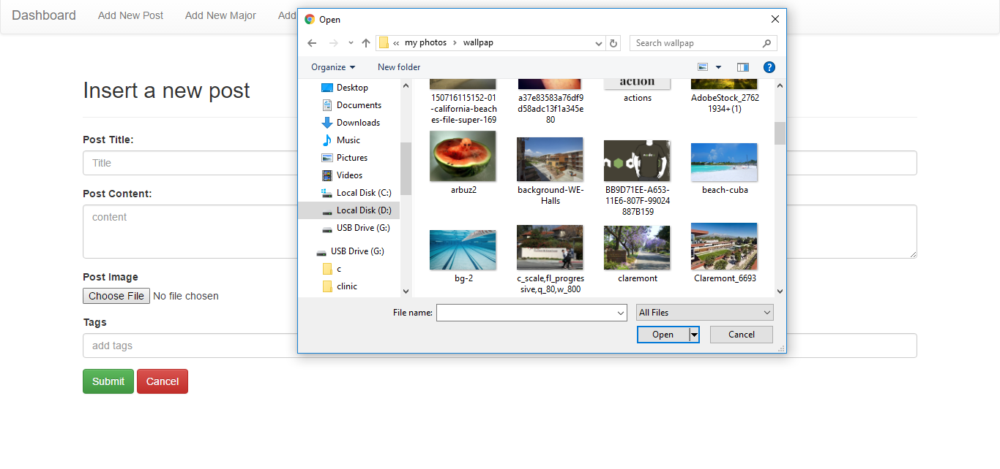
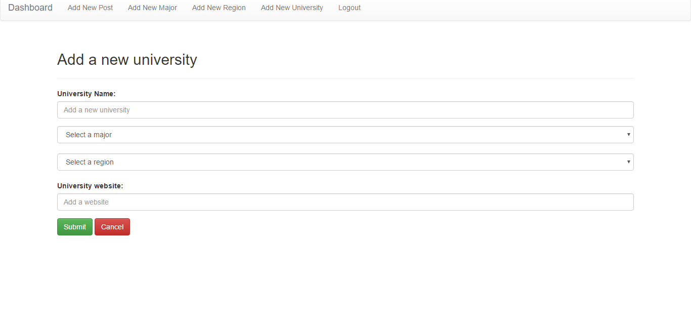

# Internet_Programming
A highly interactive website to get information about colleges and universities in Uzbekistan 
## Functionality 

The main index page welcomes its audience with an interactive news carousel showing news if added. On the main page, users can also see a navigation bar with all the required information for them to use all the features the website offers.

Programming used:
* Bootstrap for navigation and carousel

Those who are not sure what they want to study can read an artical and take a test to see what they are interested in. 

Programming used:
* PHP for adding and editing an article 
* PHP's PDO object for establishing a connection with a server
* Database for createing a table for the article 

Having completed the test, they get a table that shows their scholastic preferences.

Programming used:
* Bootstrap for creating radio buttons
* JavaScript for backend evaluation of one’s skills and predispositions 
* HTML5 for its canvas to display the result of the test   

The footer of the website offers the location of the company and some useful links for students.

Programming used:
* Bootstrap for footer
* SOAP and REST services for getting links from the database and displaying them in the footer

Whenever users click on the category tab, they receive a list of universities with the desired major chosen in the category drop down link.

If users want to choose a university according to the region, they can get a list of universities that exist in a particular region. They also get the location of those regions.

The administrator can manage and modify content of the website through the admin panel. 

